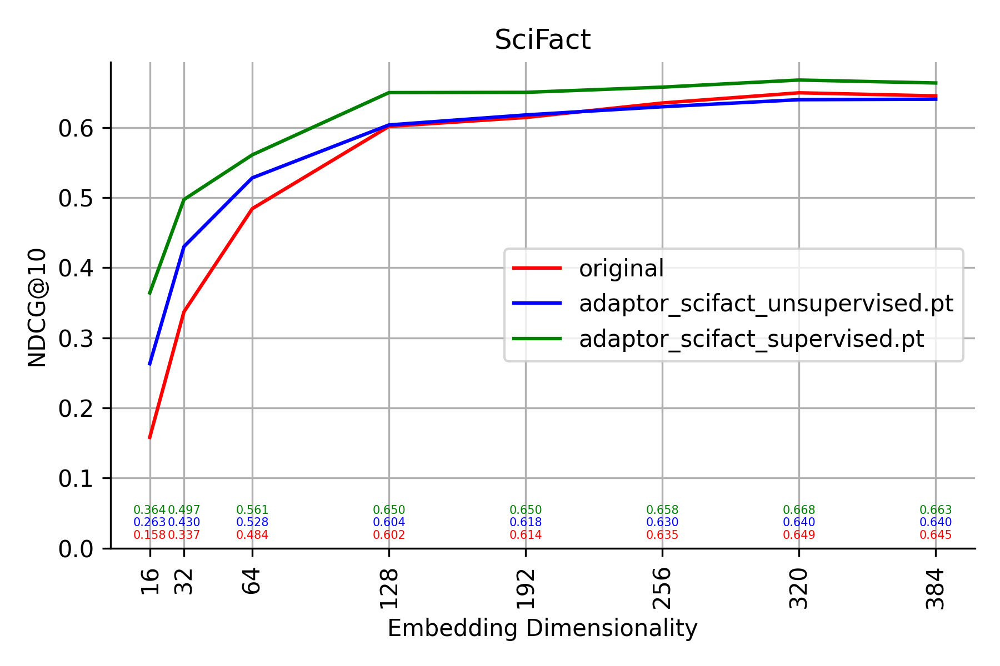

# Matryoshka Adaptor

Implementation of the Matryoshka Adaptor ([paper](https://arxiv.org/abs/2407.20243)).

The Matryoshka Adaptor is a proposed method to tune an adaptor-network to map embeddings from some source (potentially black-box) embedding model into a different space with a more desirable structure. First and foremost, mapped embeddings should posses the "Matryoshka property" (see [here](https://huggingface.co/blog/matryoshka)) which in embedding models refers to the property of largely maintained performance when only the first $k$ dimensions of mapped embeddings are considered. Use case: allows performance trade-offs through dim. reduction that can be very desirable.

For details of the method please refer to the paper.

## Usage

To train an adaptor on a specific MTEB dataset, configure and run `main.py`.

To evaluate a specific adaptor, configure and run `matryoshka_adaptor/eval.py`.

### File overview

```plaintext
main.py: entry point to train an adaptor
matryoshka_adaptor/
├── model.py: adaptor model design
├── train.py: training loop and data loading
├── losses.py: implementation of loss functions
└── eval.py: evaluation entry point and logic
```

### Requirements

- torch
- sentence-transformers: base embedding model
- datasets: training data
- pandas: training data processing
- matplotlib: evaluation plotting
- mteb: evaluation framework
- ptvsd: debugging


## Quickstart

```bash
pip install -r requirements.txt
python main.py
```

This will run the current config defined in `main.py` (training on HotpotQA). Tested on a GH200 superchip and a Vast.ai machine with A100, AMD EPYC 7J13 64-Core Processor and 256 GB RAM.

### Saved models

Both the unsupervised and supervised trained adaptor on SciFact are included in the repository and can evaluated (see `matryoshka_adaptor/eval.py`).

## SciFact evaluation

For the experiment below the `sentence-transformers/all-MiniLM-L6-v2` model was used. The trained adaptor is a shallow multi layer perceptron yielding performances shown below in the supervised and unsupervised setting respectively.

The experiment has been conducted on a GH200 chip, re-running the experiment might require the adaption of batch sizes and other parameters.



## References

Yoon, Jinsung et al. “Matryoshka-Adaptor: Unsupervised and Supervised Tuning for Smaller Embedding Dimensions.” ArXiv abs/2407.20243 (2024): n. pag. [ArXiv](https://arxiv.org/abs/2407.20243)

Muennighoff, Niklas et al. “MTEB: Massive Text Embedding Benchmark.” Conference of the European Chapter of the Association for Computational Linguistics (2022).

sentence-transformers/all-MiniLM-L6-v2 · Hugging Face. Huggingface.co. Published January 5, 2024. Accessed September 1, 2024. https://huggingface.co/sentence-transformers/all-MiniLM-L6-v2
‌